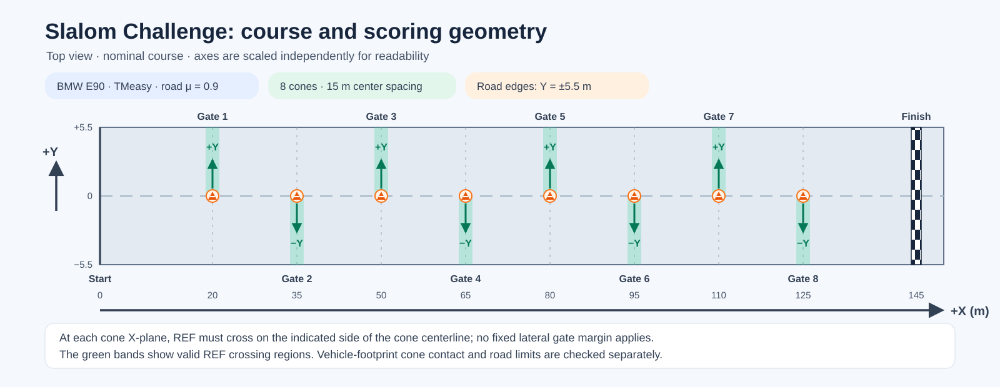
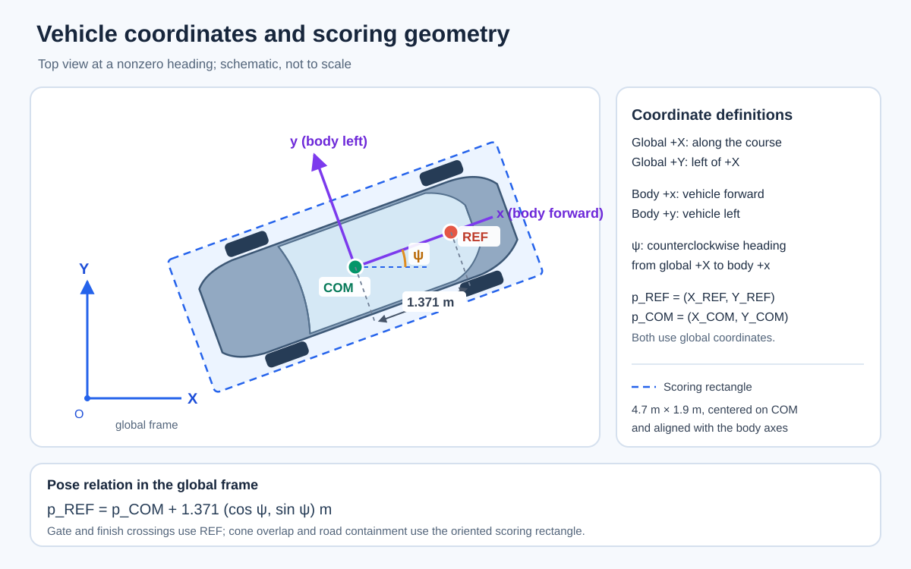

# Slalom Challenge: assignment and evaluation

Drive the supplied PyChrono car through eight alternating gates and finish as quickly as possible. Choose Easy mode (plan for a supplied tracker) or Full mode (vehicle controller). No path or speed is prescribed; the starter's slow path only demonstrates the interface.

This **individual** 2026 *Learning-Based Control for Mobility Systems* assignment must show course-based design in your code and report. Use and explain relevant concepts such as problem formulation, DP/VI/PI, value or policy approximation, rollout, or multistep lookahead; you need not use all of them.

| Milestone | Korea Standard Time (UTC+09:00) |
|---|---|
| Official course announcement | October 1, 2026, 13:00 |
| Submission deadline | November 1, 2026, 23:59 |
| Race results and individual questions in class | November 3, 2026; about five minutes per student |

Email submissions and questions to [fairytale@kaist.ac.kr](mailto:fairytale@kaist.ac.kr). See the [submission guide](SUBMISSION_AND_AI.md) for files and report format.

## Course and vehicle

In the fixed **global $(X,Y)$ frame**, +X points to the finish and +Y points left when facing +X. The body $x$ axis points forward; body $y$ points left. Heading $\psi$ is counterclockwise from global +X to body-forward. The model's reference point **REF**, at $p_{\rm REF}=(X_{\rm REF},Y_{\rm REF})$, lies 1.371 m ahead of the center of mass **COM**, at $p_{\rm COM}$:

$$
p_{\rm REF}=p_{\rm COM}+1.371(\cos\psi,\sin\psi)\ {\rm m}.
$$

REF comes from the PyChrono model; it is also used for gate checks. See the diagrams and [vehicle model](MODEL.md).

| Course item | Value |
|---|---|
| Plant and terrain | PyChrono 10.0.0 BMW E90, TMeasy tires; level rigid terrain, $\mu=0.9$ |
| Start | Nominal REF $(0,0)$ and $\psi=0$; the vehicle then settles for 0.8 s with braking applied. Its measured position and speed may be slightly nonzero, so use the first observation rather than assuming exact zeros. |
| Road | $-5.5\le Y\le5.5$ m |
| Cones | Eight radius-0.25 m cones at $(20+15j,0)$ m, $j=0,\ldots,7$; pass alternately on +Y, −Y, ... sides |
| Finish and limit | $X_{\rm REF}=145$ m, 20 m after the last cone; 60 s simulation time |
| Intervals | Controller: 0.02 s; physics: 0.001 s |

Both modes use **the same plant and success rules**. Easy submits a waypoint plan at virtual 0.5 s stages; the supplied path-tracking controller drives the car and derives segment speed from the waypoints. Its restricted planning model is a first DP exercise. Full submits a controller that observes the car and requests steering and longitudinal acceleration every 0.02 s. The runner converts acceleration to throttle or brake. You may build a lower-level tracker under a learned planner in Full mode, but `Controller.act` must return the published action. See [running and learning modes](RUNNING.md) and [questions and answers](Q_AND_A.md).

### Gate and safety rules

REF determines gates and finish time. A gate is checked at REF's **first forward crossing** of cone $j$'s X plane at time $t_j$; linear interpolation within the physics step gives the lateral position. Cone $j$ has center $(X_j,Y_j)$, with $Y_j=0$ on the basic course. Pass all eight in order, with $\sigma_j(Y_{\rm REF}(t_j)-Y_j)>0$: $\sigma_j=+1$ for even $j$ (pass on +Y), and $-1$ for odd $j$ (pass on −Y). There is **no fixed lateral gate-distance requirement**. Contact and road containment are separate checks.

A run fails for any of these:

- Cone contact or overlap between a cone's 0.25 m-radius footprint and the conservative **4.7 m × 1.9 m**, body-aligned rectangle centered at COM, even without reported physical contact.
- Any part of that rectangle leaving the road; a wrong-side gate; an invalid action or controller exception; or failure to finish within 60 s.
- Exceeding COM forward speed $-1\le v_x\le12$ m/s, the upper global REF progress speed $\dot X_{\rm REF}\le12$ m/s, or heading $|\psi|\le1.3$ rad.

The speed and heading bounds keep the task within the intended forward-slalom operating range; they are separate from the pass-side gate rule. No fixed minimum progress speed is imposed beyond the forward-crossing condition, and there is no gate-specific heading requirement. If failure and finish occur in the same physics step, failure takes priority. [`course.json`](course.json) has the machine-readable values. Easy DP plans REF positions for the same gate coordinates, but PyChrono still tests the car's footprint. See the [input and output interface](INTERFACE.md) for REF and COM measurements.

## Conceptual problem formulation

The evaluation task is a constrained free-final-time control problem. Let $\xi$ denote the full vehicle state, $u$ the controller command, $\mathcal C$ the course, and $t_j$ the forward crossing time of cone $j$'s X plane. Conceptually,

$$
\begin{aligned}
\min_{u(\cdot),\,t_f}\quad &t_f\\
\text{s.t.}\quad
&\xi(0)=\xi_{\rm settled},\qquad
  \dot\xi(t)=F_{\rm vehicle}(\xi(t),u(t);\mu,\mathcal C),\\
&u(t)\in\mathcal U,\quad
  -1\le v_x(t)\le12\ {\rm m/s},\quad
  \dot X_{\rm REF}(t)\le12\ {\rm m/s},\quad
  |\psi(t)|\le1.3\ {\rm rad},\\
&\text{the complete vehicle footprint stays on the road and touches no cone for }t\in[0,t_f],\\
&t_0>0,\quad t_j<t_{j+1}\ (j=0,\ldots,6),\quad t_7<t_f,\\
&X_{\rm REF}(t_j)=X_j,\quad
  \dot X_{\rm REF}(t_j)>0,\quad
  \sigma_j\bigl(Y_{\rm REF}(t_j)-Y_j\bigr)>0
  \quad(j=0,\ldots,7),\\
&X_{\rm REF}(t_f)=X_{\rm finish},\quad
  \dot X_{\rm REF}(t_f)>0,\quad
  t_f\le60\ {\rm s}.
\end{aligned}
$$

Here $(X_j,Y_j)$ is cone $j$'s center; $\sigma_j=+1$ for +Y and $-1$ for −Y. In Full mode, $u=(u_s^{\rm req},a_x^{\rm req})$ requests steering and longitudinal acceleration, with $\mathcal U=[-0.8,0.8]\times[-7,7\,\mathrm{m/s^2}]$. The adapter converts requests to vehicle inputs with speed-dependent saturation. [`course.json`](course.json), the [interface](INTERFACE.md), and local runner define exact discrete limits and event checks. PyChrono is the evaluation plant; the supplied control-oriented model is an approximation for design. Course methods may use a different training objective or problem formulation, provided the resulting solution is tested against these evaluation rules. Easy mode's finite-horizon DP is a simplified version of this task.

## What is supplied and what you submit

The repository provides a practice runner, course, controller contract, both mode interfaces, 5 m/s example, approximate model and validation data, and report template. [Running](RUNNING.md) explains result files and startup errors.

Submit **one ZIP with a PDF report and runnable solution**: `easy_plan.json` or `controller.py`, plus helper, training, and learned-weight files needed to reproduce your method. You may submit both modes if you identify which result to evaluate. Explain your design and own validation in the report; see [submission and AI use](SUBMISSION_AND_AI.md).

## Assessment

- **Performance:** Successful finish time is scored against absolute-time thresholds, not class rank. Thresholds and points will be announced separately.
- **Failure:** A failed run receives the minimum performance score.
- **Course-based design and understanding:** Code, report, and November 3 individual discussion assess your method and explanation. Report length is not graded.
- **Course relevance:** A generic RL library run without a course-based formulation, controller design, and validation receives zero credit.

For simulator or scoring issues, use [Troubleshooting](TROUBLESHOOTING.md); confirmed workarounds will appear there.
