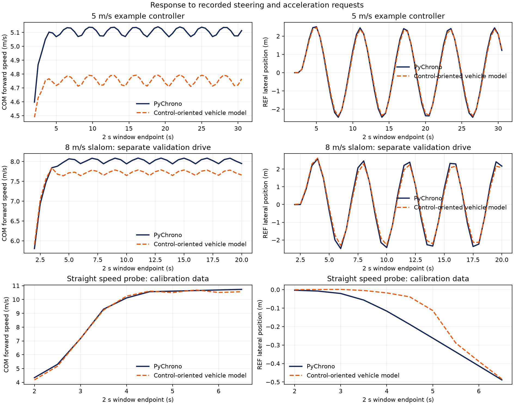

# Supplied control-oriented vehicle model

The evaluator uses PyChrono 10.0.0's BMW E90 with TMeasy tires on level rigid terrain. PyChrono takes steering, throttle, and brake inputs. Full mode instead asks you for **steering and longitudinal-acceleration requests**; the supplied input adapter converts them to native inputs. The control-oriented vehicle model in [dynamics.py](dynamics.py) is a reduced planar bicycle model fitted at friction **μ = 0.9**. See [Project Chrono's vehicle manual](https://api.projectchrono.org/manual_vehicle.html) for the underlying framework.

The **runner**, [run_local.py](run_local.py), executes the measured-state feedback loop. The **input adapter** in [contract.py](contract.py) converts requests to vehicle inputs. `dynamics.predict` includes the same conversion for candidate commands. [Running](RUNNING.md#how-the-system-works) shows both system diagrams.

Global axes are capital X, Y; rotating body axes are lowercase x, y.

## Coordinates and state

The seven-state vector is s = (XREF, YREF, ψ, vx, vy, r, δ).

Global +X follows the course and +Y points left. Body +x points forward and +y left. Positions pREF = (XREF, YREF) and pCOM = (XCOM, YCOM) use **global** coordinates. Heading ψ is counterclockwise from global +X to body +x; vx, vy are body-frame COM velocities, r is yaw rate, and δ is measured mean front-wheel steering.

REF lies aREF = 1.371 m ahead of COM:

pREF = pCOM + aREF (cos ψ, sin ψ).

Its kinematics are:

- ẊREF = vx cos ψ − (vy + aREF r) sin ψ.
- ẎREF = vx sin ψ + (vy + aREF r) cos ψ.
- ψ̇ = r.

The aREF r term matters in a slalom. Gates and finish use REF; collision scoring uses a **4.7 m × 1.9 m** body-aligned rectangle centered at COM. A COM planner must transform poses to REF for gate/finish checks and test the oriented footprint against cones and road edges. A fixed COM clearance margin cannot exactly replace these pose-dependent checks.

Mass is m = 1909.883 kg and wheelbase is L = 2.776 m. [model_parameters.json](model_parameters.json) contains the wheelbase split, steering map, tire stiffness, yaw inertia, and other **fitted effective coefficients**.

## Dynamics and actuator

### From your command to vehicle motion

1. **Your controller** requests u = (usreq, axreq): steering in [−0.8, 0.8] and acceleration in [−7, 7] m/s².
2. **The input adapter** limits steering changes and, at the measured vx, selects throttle ut or brake ub. Each pedal lies in [0, 0.6]; both are never nonzero together.
3. **The vehicle responds** with wheel-angle dynamics and longitudinal/lateral forces. Your next observation measures that response.

For model-based planning or policy improvement, call `dynamics.predict(state, command, previous_steering, scenario)`. It implements this complete prediction pipeline; you do not need to implement a pedal inverse yourself.

Keep these three longitudinal quantities distinct:

| Quantity | Meaning |
|---|---|
| axreq | Your acceleration request, in m/s² |
| âx | The model's propulsion, braking, and resistance term after pedal conversion |
| v̇x | Change of body-frame forward speed; turning also contributes |

### Input conversion

The runner limits the applied steering input us to a change of **0.04 per 0.02 s**. This interface limit prevents abrupt commands; the wheel-angle lag below is a separate vehicle response. Prediction therefore also needs the previously applied steering input. Easy uses the same steering limit.

For forward motion, the **open-loop** pedal conversion satisfies the fitted static map at the start of step k:

âx(vx,k, ut,k, ub,k; μ) = clip(ax,kreq, amin(vx,k), amax(vx,k)).

[contract.acceleration_bounds](contract.py) reports these speed-dependent achievable bounds. The inverse is exact for this fitted map within the bounds. **PyChrono can still respond differently** because the map is approximate. Pedals remain fixed for 0.02 s, and there is no acceleration-feedback correction in the input adapter. If vx &lt; 0, it commands braking to recover.

### Vehicle equations

The longitudinal, lateral, and yaw dynamics are:

- v̇x = âx + r vy − Fyf sin δ / m.
- v̇y = (Fyf cos δ + Fyr) / m − r vx.
- ṙ = (lf Fyf cos δ − lr Fyr) / Iz, where lf + lr = L.

The first equation explains why an acceleration request is not generally equal to v̇x. Front/rear slip angles are approximated by:

- αf = δ − atan2(vy + lf r, max(vx, 1)).
- αr = −atan2(vy − lr r, max(vx, 1)).

The lateral forces use Fyi = Fi,cap tanh(Ci αi / Fi,cap), for i = f, r. Capacity depends on friction, static axle load, and simplified sharing with longitudinal force. This smooth fit is not an exact tire friction ellipse.

The fitted longitudinal term is:

âx = aD(vx, ut; μ) − aB(vx, ub; μ) − d0 tanh(vx / 0.2) − d2 vx |vx| + 0.35 R(vx).

Here aD and aB are fitted propulsion and braking terms. [contract.py](contract.py), [dynamics.py](dynamics.py), and [model_parameters.json](model_parameters.json) define the saturation and coefficients. R is the high-speed correction below.

### Steering response and low-speed blending

Measured front-wheel steering follows a speed-dependent gain and first-order lag:

δ̇ = [(sg + sv vx²) us − δ] / τs.

The fitted values are sg = 0.551426, sv = −0.00042031, and τs = 0.007088 s. The applied dimensionless input us and measured wheel angle δ, in radians, are different quantities.

Below **2 m/s**, the implementation blends the lateral/yaw equations with a kinematic bicycle response. This does not directly modify the longitudinal acceleration map. [dynamics.py](dynamics.py) implements the blend, capacity floors, smoothing, and midpoint integration. `dynamics.predict` predicts one **0.02 s** step from a `{"steering", "acceleration"}` request. Lower-level `dynamics.step` and `dynamics.replay` take applied `[steering, throttle, brake]` inputs. `dynamics.parameters()` rejects friction other than **0.9**, the validated surface.

### High-speed correction

The propulsion term has the form aD = D tanh(g(v) utqₜ / D), with v = max(vx, 0). Here D is the drive saturation capacity and g(v) is the drive gain:

g(v) = max(0.1, a0 + a1 v + a2 v², H(v)), where H(v) = 5 for v ≥ 9.2 m/s and 0 otherwise.

The added **0.35 R(vx)** changes modeled coast/drag. R = 0 below 9.2 m/s and R = 1 above 9.5 m/s. Between them, R = 3z² − 2z³ with z = (vx − 9.2) / 0.3. These corrections are **longitudinal**; sv vx² separately changes steering gain. Straight drive and coast traces calibrated these terms after the earlier fit underestimated propulsion near the **12 m/s** course limit. Pedal conversion and prediction use the same corrected map.

The correction does not make the request an exact PyChrono acceleration. Near 10.5 m/s in a straight drive, axreq = 0 still increased speed by **0.207 m/s over 2.4 s**. Leave speed margin and check your controller near the course limit.

## Comparison with PyChrono

The main check replays recorded steering and acceleration requests through [dynamics.predict](dynamics.py), including steering limits and pedal conversion. Each window starts from a measured state and runs open loop for 0.5, 1, or 2 s. Windows start 0.5 s apart and can overlap. The plot shows **2 s endpoints**.

<table>
<thead><tr><th>PyChrono drive</th><th>Speed range (m/s)</th><th>Horizon (s)</th><th>Forward-speed RMSE (m/s)</th><th>REF lateral RMSE (m)</th></tr></thead>
<tbody>
<tr><td rowspan="3">5 m/s example controller</td><td rowspan="3">0.17–5.14</td><td>0.5</td><td>0.0873</td><td>0.0056</td></tr>
<tr><td>1.0</td><td>0.1732</td><td>0.0210</td></tr>
<tr><td>2.0</td><td><strong>0.3453</strong></td><td><strong>0.0983</strong></td></tr>
<tr><td rowspan="3">Separate 8 m/s slalom</td><td rowspan="3">0.17–8.09</td><td>0.5</td><td>0.0763</td><td>0.0139</td></tr>
<tr><td>1.0</td><td>0.1480</td><td>0.0449</td></tr>
<tr><td>2.0</td><td><strong>0.2833</strong></td><td><strong>0.1596</strong></td></tr>
<tr><td rowspan="3">High-speed straight probe</td><td rowspan="3">0.17–10.74</td><td>0.5</td><td>0.0947</td><td>0.0053</td></tr>
<tr><td>1.0</td><td>0.1045</td><td>0.0198</td></tr>
<tr><td>2.0</td><td><strong>0.1184</strong></td><td><strong>0.0777</strong></td></tr>
</tbody>
</table>

The **separate 8 m/s slalom was recorded with fixed model parameters** and was not used to refit them. It passed all eight gates in **20.405 s**, with **0.998 m minimum scored footprint clearance**; its [run result](validation/request_fast_slalom_result.json) records the outcome. The high-speed straight probe was used during longitudinal calibration.

Reproduce the table and plot with [validate_requests.py](validate_requests.py), using the [5 m/s example controller trace](validation/request_starter.npz), [8 m/s trace](validation/request_fast_slalom.npz), and [high-speed straight trace](validation/request_straight.npz). [ax_request_metrics.json](validation/ax_request_metrics.json) contains the summary. Matplotlib is needed only to regenerate the plot.

### Why the 5 m/s speed prediction has a bias

The 5 m/s example controller's steady speed is **5.06–5.14 m/s**, where low-speed blending is inactive. After 4 s, 2 s predictions have a mean forward-speed error of **−0.352 m/s**. The residual is mainly a systematic longitudinal-response mismatch, not a low-speed-blending effect.

A separate **zero-steering, 5 m/s straight diagnosis** reproduces the bias: model acceleration averages **−0.179 m/s²**, while measured acceleration is **+0.003 m/s²**. The fitted static inverse error is below **4 × 10⁻¹⁶ m/s²**. Thus the conversion is algebraically accurate for its model, but the fitted propulsion/resistance response differs from PyChrono in this light-throttle regime. This test does not separate propulsion error from resistance error.

The [diagnosis metrics](validation/speed_bias_diagnosis.json) define the sample selection and errors. Its [straight trace](validation/request_straight_5ms.npz) uses the same state/request/applied-input format as the main traces; it deliberately stops at 12 s with cones moved beyond the driven segment. It is a response diagnosis, not a challenge result. The appropriate model improvement is to identify propulsion and coast response around **4–6 m/s and small throttle**, then check separate slalom data. The published parameters are unchanged in this documentation revision.

### Choosing a prediction horizon

The tests support **short-horizon prediction with measured-state feedback** on the friction-0.9 course. In the 8 m/s drive, lateral RMSE rises from 0.0139 m at 0.5 s to 0.1596 m at 2 s. Use the error together with actual clearance when choosing a horizon; RMSE is an average, not a worst-case safety bound. The reduced state omits roll/pitch, gear, engine, wheel, and tire internal states.

For your basic-course Full run, execute `python validate_requests.py --run runs/your_run` in the supplied environment. It writes `model_check.json` with the same horizon-dependent errors. For a separate check of the vehicle equations alone, [fixed-input metrics](validation/metrics.json), [plots](validation/model_comparison.png), and [validate_model.py](validate_model.py) give the model the same applied steering and pedals as PyChrono; these errors exclude the request-conversion step.
