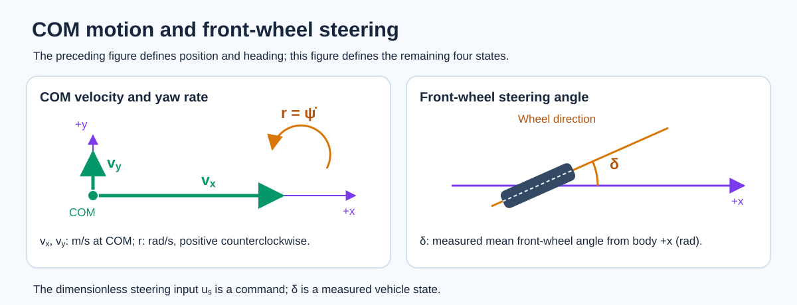
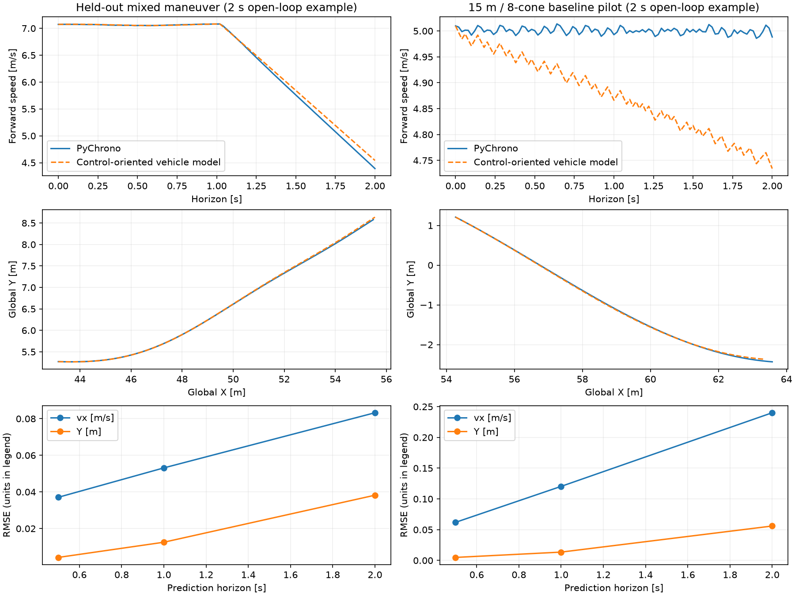

# Supplied control-oriented vehicle model

The evaluator uses PyChrono 10.0.0's BMW E90 with TMeasy tires on level rigid terrain. [`dynamics.py`](dynamics.py) is a **reduced predictor** fitted to that plant at road friction $\mu=0.9$: planar nonlinear bicycle dynamics plus a steering actuator. It supports controller design, but does not reproduce every PyChrono state or guarantee behavior at untested limits. The supplied open-loop adapter converts acceleration requests to native pedals. See [Project Chrono's vehicle manual](https://api.projectchrono.org/manual_vehicle.html) for the underlying framework.

Global axes are capital $X,Y$; rotating body axes are lowercase $x,y$.

## Coordinates and state

The seven-state vector is

$$
s=(X_{\rm REF},Y_{\rm REF},\psi,v_x,v_y,r,\delta).
$$

Global +X follows the course and +Y points left. Body $+x$ points forward and $+y$ left. $p_{\rm REF}=(X_{\rm REF},Y_{\rm REF})$ and $p_{\rm COM}=(X_{\rm COM},Y_{\rm COM})$ are **global** positions. Heading $\psi$ is counterclockwise from global +X to body $+x$; $v_x,v_y$ are body-frame COM velocities, $r$ is yaw rate, and $\delta$ is measured mean front-wheel steering. REF lies $a_{\rm REF}=1.371$ m ahead of COM:

$$
p_{\rm REF}=p_{\rm COM}+a_{\rm REF}(\cos\psi,\sin\psi),
$$
$$
\dot X_{\rm REF}=v_x\cos\psi-(v_y+a_{\rm REF}r)\sin\psi,\qquad
\dot Y_{\rm REF}=v_x\sin\psi+(v_y+a_{\rm REF}r)\cos\psi,\qquad
\dot\psi=r.
$$

The $a_{\rm REF}r$ term matters in a slalom. Gates and finish use REF; collision scoring uses a **4.7 m × 1.9 m** body-aligned rectangle centered at COM. No third vehicle point is used. A COM planner must transform predicted poses to REF for gate/finish checks and test the oriented footprint against cones and road edges. One fixed COM clearance margin cannot exactly replace those pose-dependent checks.

Mass is $m=1909.883$ kg and wheelbase is $L=2.776$ m. [`model_parameters.json`](model_parameters.json) holds the wheelbase split, steering map, tire stiffness, yaw inertia, and other **fitted effective coefficients**, not independently measured vehicle specifications.

## Dynamics and actuator

The Full-mode action $u=(u_s^{\rm req},a_x^{\rm req})$ requests dimensionless steering ($|u_s^{\rm req}|\le0.8$) and longitudinal acceleration ($|a_x^{\rm req}|\le7$ m/s²). The [adapter](INTERFACE.md) limits applied steering $u_s$ to a change of 0.04 per 0.02 s. At the current $v_x$, a fixed **open-loop inverse map** selects throttle $u_t$ or brake $u_b$, each in $[0,0.6]$ and never both nonzero. It has no acceleration feedback or online adaptation.

The fitted pedal model gives speed-dependent bounds $a_{\min}(v_x)$ and $a_{\max}(v_x)$. At the **start** of step $k$,

$$
a_{x,k}^{\rm eff}=\operatorname{clip}\!\left(a_{x,k}^{\rm req},a_{\min}(v_{x,k}),a_{\max}(v_{x,k})\right).
$$

Pedals stay fixed for 0.02 s; changing speed can make instantaneous $a_x^{\rm model}(t)$ differ slightly from that initial effective term. [`contract.acceleration_bounds`](contract.py) returns the initial feasible interval. Within it, the inverse of the fitted static map is algebraically one-to-one at fixed forward speed. PyChrono residuals are model-to-plant error, not numerical inversion error. [`dynamics.predict`](dynamics.py) applies this same adapter, so model-based PI or rollout can optimize requests without implementing the pedal inverse.

The main lateral and yaw equations are

$$
\dot v_x=a_x^{\rm model}+r v_y-\frac{F_{yf}\sin\delta}{m},\qquad
\dot v_y=\frac{F_{yf}\cos\delta+F_{yr}}{m}-r v_x,
$$
$$
\dot r=\frac{l_fF_{yf}\cos\delta-l_rF_{yr}}{I_z},\qquad l_f+l_r=L.
$$

Front/rear slip-angle approximations are

$$
\alpha_f=\delta-\operatorname{atan2}(v_y+l_fr,\max(v_x,1)),\qquad
\alpha_r=-\operatorname{atan2}(v_y-l_rr,\max(v_x,1)).
$$

Lateral force is $F_{yi}=F_{i,\mathrm{cap}}\tanh(C_i\alpha_i/F_{i,\mathrm{cap}})$; capacity depends on friction, static axle load, and simplified sharing with longitudinal force. This smooth fit is not an exact tire friction ellipse. The first equation shows why $a_x^{\rm model}$ is **not** $\dot v_x$ during a turn. The pedal map, resistance, and smooth saturation are defined in [`contract.py`](contract.py) and [`dynamics.py`](dynamics.py), with coefficients in [`model_parameters.json`](model_parameters.json).

Measured steering follows a fitted speed-dependent *linear* gain and first-order lag:

$$
\dot\delta=\frac{(s_g+s_vv_x^2)u_s-\delta}{\tau_s},
\qquad(s_g,s_v,\tau_s)=(0.551426,-0.00042031,0.007088\ {\rm s}).
$$

Below **2 m/s**, the implementation blends the lateral/yaw equations with a kinematic bicycle response. [`dynamics.py`](dynamics.py) defines capacity floors, smoothing, and midpoint integration. `dynamics.predict(state, command, previous_steering, scenario)` applies the adapter and predicts one **0.02 s** step from a `{"steering", "acceleration"}` request. Lower-level `dynamics.step` and `dynamics.replay` instead take applied `[steering, throttle, brake]` inputs for reproducible validation traces. `dynamics.parameters()` rejects friction other than **0.9** because other surfaces were not validated. Actual PyChrono acceleration may differ, especially outside measured driving conditions.

### High-speed correction

A longitudinal correction begins at **9.2 m/s**. Separate straight drive and coast traces calibrated it after the original quadratic drive fit underestimated acceleration near the **12 m/s** course limit. Both inverse adapter and predictor include it. On one independent fast slalom trace, the **2 s fixed-applied-input** forward-speed RMSE fell from **0.760 to 0.183 m/s** and REF lateral RMSE from **0.181 to 0.103 m**. This trace differs from the aggressive maneuver below.

The correction does not make requested acceleration a guaranteed physical acceleration. In a separate PyChrono straight run near **10.5 m/s**, nominal $a_x^{\rm req}=0$ still increased speed by **0.207 m/s over 2.4 s**. Leave speed margin and test the closed-loop controller in PyChrono near the 12 m/s failure limit.

## Comparison with PyChrono

The [validation traces and metrics](validation/metrics.json) replay **the same applied steering, throttle, and brake inputs** in PyChrono and the predictor. These results measure vehicle-model error given native inputs; they do **not** establish how accurately the open-loop adapter tracks acceleration requests. Each prediction window lasts 0.5, 1, or 2 s: it starts from a measured state, then runs open loop without further measurement injection. Windows start 0.5 s apart and may overlap. The held-out mixed maneuver was excluded from coefficient fitting; the baseline course maneuver was included. Metrics omit the held-out trace's first 0.8 s. Steering simplification was fitted on calibration traces and checked on disjoint held-out traces, including the aggressive maneuver summarized here.

| Dataset | Horizon | Forward-speed endpoint RMSE | REF lateral-position endpoint RMSE |
|---|---:|---:|---:|
| Held-out mixed maneuver | 0.5 s | 0.0371 m/s | 0.0042 m |
| Held-out mixed maneuver | 1.0 s | 0.0531 m/s | 0.0125 m |
| Held-out mixed maneuver | 2.0 s | 0.0832 m/s | 0.0382 m |
| Baseline course maneuver, included in fitting | 0.5 s | 0.0620 m/s | 0.0049 m |
| Baseline course maneuver, included in fitting | 1.0 s | 0.1204 m/s | 0.0135 m |
| Baseline course maneuver, included in fitting | 2.0 s | 0.2401 m/s | 0.0560 m |
| Separate held-out aggressive course maneuver (summary only) | 0.5 s | 0.2071 m/s | 0.0241 m |
| Separate held-out aggressive course maneuver (summary only) | 1.0 s | 0.3223 m/s | 0.0702 m |
| Separate held-out aggressive course maneuver (summary only) | 2.0 s | 0.4439 m/s | 0.2111 m |

The public `validation/heldout_maneuver_mu0.9.npz` and `validation/course_baseline_maneuver.npz` contain `states` shaped `(N+1,7)`, `actions` shaped `(N,3)`, and 0.02 s samples. Run `validate_model.py` to regenerate their plot and metrics. The aggressive trace's controller and raw trajectory are not supplied. Its high-speed correction lowered 2 s forward-speed error from **0.4925 to 0.4439 m/s**, while REF lateral error rose from **0.1938 to 0.2111 m**.

These are **short-window** tests; their errors matter when cone clearance is small. Full-course open-loop replay accumulates error. Accuracy at large sideslip, wheel spin or lock, other friction, and extreme student policies is unverified. The model omits PyChrono's full roll/pitch, gear, engine, wheel, and tire states. Validate the final controller in PyChrono.
