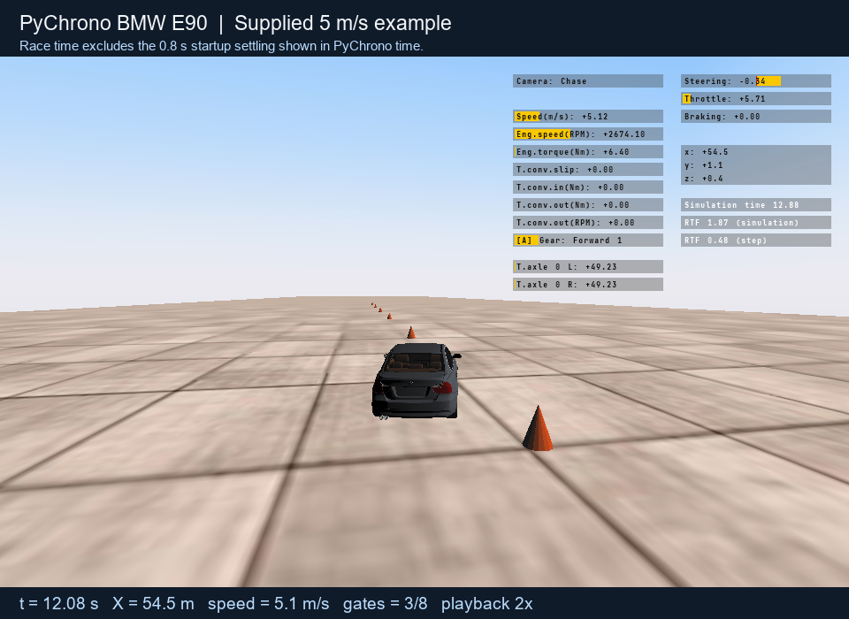

# Slalom Challenge

In this individual 2026 **Learning-Based Control for Mobility Systems** challenge, drive a PyChrono BMW E90 through eight alternating cones and finish as fast as possible. Stay on the road, avoid contact, respect vehicle limits, and justify your design using course methods.

Choose one mode; both use the same course and success rules.

| Mode | Your task | Supplied support |
|---|---|---|
| **Easy** | Plan a grid-based waypoint path with virtual 0.5 s steps; submit `easy_plan.json` | Simplified planning model and fixed path-tracking controller |
| **Full** | Write a `Controller` that requests steering and acceleration every 0.02 s | Reduced vehicle dynamics model and a 5 m/s example controller |

In Easy mode, the supplied path tracker drives the car every 0.02 s along your plan; actual waypoint arrival times may differ from the virtual steps. In Full mode, your controller chooses steering and acceleration every 0.02 s; it may combine a learned planner with your own tracker.

The supplied 5 m/s path-tracking example checks installation and the interface. Its path and speed are examples, not required targets. Course configuration, runner, model validation data, and interface checks are included. Click the image to watch the drive.

## Start

1. [Install](INSTALL.md) the environment.
2. [Run the 5 m/s example](RUNNING.md) and inspect `result.json` and `trajectory.npz`.
3. Use [Start here](START_HERE.md) to try the predictor and run data, then develop a method in your chosen mode.

## Guides

| Guide | Contents |
|---|---|
| [Assignment](ASSIGNMENT.md) | Rules, dates, scoring |
| [Installation](INSTALL.md) | Windows x64 setup |
| [Start here](START_HERE.md) | Predictor, result files, learned artifacts |
| [Running](RUNNING.md) | Both modes and local tests |
| [Interface](INTERFACE.md) | Inputs and outputs |
| [Model](MODEL.md) | Predictor and validation |
| [Submission and AI](SUBMISSION_AND_AI.md) | Files, report, AI disclosure |
| [Troubleshooting](TROUBLESHOOTING.md) | Technical issues |
| [Q&A](Q_AND_A.md) | Common questions |
