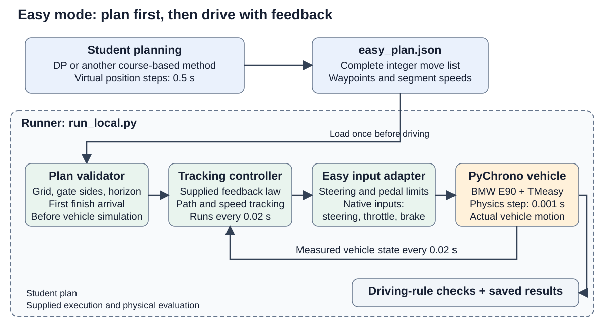
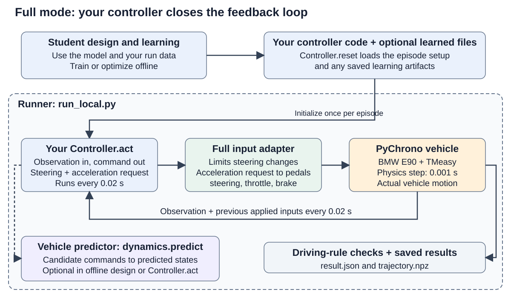

# Run and develop a controller

Complete [installation](INSTALL.md) first. Run commands from the repository root in PowerShell or Miniconda Prompt. Both modes use the same BMW E90/TMeasy PyChrono course and success rules; `--mode` selects the control task.

## How the system works

| Component | What it does | Supplied implementation |
|---|---|---|
| **Runner** | Starts a driving episode, calls the controller every 0.02 s, advances PyChrono, checks the driving rules, and saves results | [run_local.py](run_local.py) |
| **Plan validator** (Easy only) | Checks a submitted JSON plan's integer moves, planned gate sides, stage count, and first finish arrival before driving starts | `validate_plan` in [easy_mode.py](easy_mode.py) |
| **Tracking controller** | Uses measured vehicle state to follow a planned path and regulate speed; supplied in Easy, or implemented inside your Full controller | [easy_mode.py](easy_mode.py); Full example in [controller.py](controller.py) |
| **Input adapter** | Checks command values and limits steering changes; in Full, also converts requested acceleration to throttle or brake | `apply_easy_action` / `apply_action` in [contract.py](contract.py) |
| **Vehicle predictor** | Predicts the next state from a candidate Full-mode command for your model-based design | `predict` in [dynamics.py](dynamics.py) |

| | Easy: waypoint plan | Full: vehicle control |
|---|---|---|
| Your task | Plan integer REF waypoint moves with virtual **0.5 s** stages; save the complete plan as `easy_plan.json` | Implement `Controller.reset` and `Controller.act`; request steering and acceleration every **0.02 s** |
| Supplied support | Simplified grid model and fixed path tracking controller | Reduced control-oriented vehicle model and a 5 m/s example controller |
| Driving test | The supplied tracking controller drives your plan in PyChrono | Your controller drives PyChrono through the input adapter |





The runner performs the feedback loop shown above. PyChrono updates the vehicle every **0.001 s**; a controller receives a new observation every **0.02 s**. Easy's **0.5 s** interval belongs to the virtual plan, so actual waypoint arrival times can differ. The runner checks actual collision, road, speed, heading, gate, and finish conditions during the physics steps.

## Check the installation

```powershell
conda run --no-capture-output -n slalom2026 python .\run_local.py --mode full --controller .\controller.py --output .\runs\starter
```

The supplied [`controller.py`](controller.py) tracks a sample sinusoidal path at **5 m/s**. This low-speed drive checks installation and shows the controller interface; its path and speed are not assigned references or a learning-based solution. In one headless PyChrono 10.0.0 run it passed all eight gates in **30.660 s**. Check `runs/starter/result.json` for `"status": "success"`, `gates_passed: 8`, and `finish_time_s` (simulation time); small numerical differences are possible.

Runs are headless by default. Add `--visual` in a Windows graphical session to inspect the car and finish line; use headless runs for reported times. A completed runner call writes `result.json` and `trajectory.npz`. A malformed plan, controller import/reset error, or simulator exception can stop before either file is written; check the terminal error. See [INTERFACE.md](INTERFACE.md) for output fields.

## Easy: finite-horizon DP

Plan a virtual REF point through the gates with the smallest arrival stage. The supplied tracking controller then drives that plan in PyChrono. The following is one complete finite-horizon DP formulation; its planning bounds are design choices you may adjust.

### DP problem definition

| Item | Definition |
|---|---|
| Stage and grid | $\Delta=0.5$ s; $h_X=1$ m; $h_Y=0.5$ m; $k=0,\ldots,K_{\max}-1$ with $K_{\max}=120$ |
| State | $z_k=(X_k,Y_k,V_{k-1},\chi_{k-1})$: planned REF position and the previous segment's virtual speed and course angle |
| Initial state | $z_0=(0,0,0,0)$ |
| Control | $u_k=(m_k,n_k)$, with $m_k\in\{1,2,3,4,5\}$ and $n_k\in\{-4,\ldots,4\}$ |
| Position transition | $X_{k+1}=X_k+m_kh_X$; $Y_{k+1}=Y_k+n_kh_Y$ |
| Memory transition | $z_{k+1}=(X_{k+1},Y_{k+1},V_k,\chi_k)$; $V_k$ and $\chi_k$ are defined below |
| Required gate constraint | $d_j>0$ for **every cone plane crossed by the move**; $d_j$ is defined below |
| Optional planning constraints | A selected gate margin and any chosen speed, turn, or road-strip bounds from the table below |
| Finish | First arrival at $X_k\ge X_F=145$ m, after passing all eight planned gates, enters an absorbing **finish** state |
| Planned failure | A gate-side violation or violation of a bound you selected enters an absorbing **failure** state |

Use $M=1000$ as an example failure penalty, or choose another $M>K_{\max}$. Define the stage and terminal costs as follows:

| Cost | Condition | Value |
|---|---|---:|
| $g(z_k,u_k)$ | Active state and admissible move, including the move reaching the finish | 1 |
| $g(z_k,u_k)$ | Active state and move causing planned failure | $M$ |
| $g(z_k,u_k)$ | Already in an absorbing finish or failure state | 0 |
| $G(z_{K_{\max}})$ | Finish reached, or failure already charged at an earlier stage | 0 |
| $G(z_{K_{\max}})$ | Still active at the horizon: finish not reached | $M$ |

The objective is $\min_{\pi}\left[\sum_{k=0}^{K_{\max}-1}g(z_k,u_k)+G(z_{K_{\max}})\right]$ subject to the transitions above, where $\pi$ is your sequence of state-feedback decision rules. A successful plan arriving at stage $K$ costs exactly $K$; every failed plan costs at least $M$. Thus the successful-plan objective minimizes virtual time $K\Delta$. All moves increase X, which makes backward DP possible. The repository supplies the model and execution interface; implement your own solver.

The plan validator enforces the published integer action set, at most 120 moves, correct planned gate sides, and a final move that is the **first** finish arrival. It rejects a violation before simulation. The failure cost $M$ belongs to your DP; the runner evaluates actual driving through the common PyChrono rules. Grid and horizon values are in [easy_spec.json](easy_spec.json); course geometry is in [course.json](course.json).

### Meaning of the motion and gate variables

A move has virtual segment speed $V_k=\sqrt{(m_kh_X)^2+(n_kh_Y)^2}/\Delta$ and course angle χ<sub>k</sub> = atan2(n<sub>k</sub> h<sub>Y</sub>, m<sub>k</sub> h<sub>X</sub>). The angle's first argument is lateral displacement and the second is longitudinal displacement. These quantities describe the planned segment; they differ from COM speed and body heading. Previous speed and angle are needed only for bounds depending on acceleration or turning. If you omit those bounds, the planning state can be reduced to $(X_k,Y_k)$.

For the basic course, cone $j$ is at $X_j=20+15j$ m and $Y_j=0$, with $j=0,\ldots,7$. If $X_k<X_j\le X_{k+1}$, linearly interpolate using $\lambda_j=(X_j-X_k)/(X_{k+1}-X_k)$ and $Y_{\mathrm{cross},j}=Y_k+\lambda_j n_kh_Y$. Its signed planned offset is $d_j=\sigma_jY_{\mathrm{cross},j}$, with $\sigma_j=(-1)^j$: +Y passes at even-numbered cones and −Y passes at odd-numbered cones.

**The required condition is $d_j>0$ at every gate**, regardless of your other planning choices. You may impose a larger clearance target $d_j\ge d_{\mathrm{plan}}>0$. In a local course with shifted cones, subtract that cone's lateral position before applying the sign; see [INTERFACE.md](INTERFACE.md).

### Adjustable planning bounds

The following starting values are listed as `suggested_...` fields in [easy_spec.json](easy_spec.json). You may tighten or relax them in your DP. They are not plan-validator acceptance rules.

| Adjustable DP planning bound | Suggested starting value |
|---|---|
| Road strip | $\lvert Y_{k+1}\rvert\le3$ m |
| Segment speed | $V_k\le11.5$ m/s |
| Course angle | $\lvert\chi_k\rvert\le0.58$ rad |
| Acceleration | $(V_k-V_{k-1})/\Delta\le4$ m/s² |
| Deceleration | $(V_{k-1}-V_k)/\Delta\le6$ m/s² |
| Angle change | $\lvert\chi_k-\chi_{k-1}\rvert\le0.31$ rad |
| Virtual lateral acceleration | $V_k\lvert\chi_k-\chi_{k-1}\rvert/\Delta\le6$ m/s² |

The grid assumes exact waypoint motion and omits the vehicle footprint, tires, and actuator dynamics. Relaxing a bound can shorten the DP plan while making it harder to drive. PyChrono checks actual contact, road containment, speed, heading, gate sides, and finish time with the same rules for both modes.

### Planning and driving results

The effect of a chosen gate margin is visible in two backward-DP plans that used the table's suggested bounds as DP constraints. Both satisfy the virtual gate rule; their **signed planned offset $d_j$ equals the stated value at every gate**. The planned $Y_{\mathrm{cross},j}$ is $+d_j$ at even-numbered cones and $-d_j$ at odd-numbered cones.

| Chosen $d_j$ | Planned stages | PyChrono with the supplied tracking controller |
|---:|---:|---|
| 0.5 m | 31 (15.5 s virtual) | **Cone contact at 3.384 s, before gate 1** |
| 2.5 m | 48 (24.0 s virtual) | **Success:** 8 gates, finish 24.074 s; minimum scored footprint clearance 0.734 m |

The 0.5 m plan passed the *planning* gate-side test but its vehicle footprint hit a cone. The 2.5 m case succeeded in this run; a planning margin is a design choice, not a guarantee or an evaluation rule.

Save **all** planned 0.5 s moves, from the start through the first finish-line crossing, as one JSON object with exactly one `moves` list. Each entry is an integer pair `[m_k, n_k]`; the last pair must first reach or cross the finish. These complete, independent hand-designed examples show both outcomes without supplying a DP solver or the DP paths above:

| Complete plan file | Planned gate offset | PyChrono result |
|---|---|---|
| [Wide 73-stage plan](examples/easy_success_73.json) | 2.5 m at every gate | **Success:** 8 gates, finish 36.548 s; minimum footprint clearance 0.485 m |
| [Narrow 73-stage plan](examples/easy_failure_73.json) | 0.5 m at every gate | **Cone contact:** 5.341 s, before gate 1 |

The plans use the same longitudinal grid moves. Their differing lateral waypoints show why passing the virtual gate-side test does not establish physical clearance. They demonstrate the file interface; copying an example alone does not meet the assignment's course-based design requirement. Try either complete file directly:

```powershell
conda run --no-capture-output -n slalom2026 python .\run_local.py --mode easy --plan .\examples\easy_success_73.json --output .\runs\easy_success
conda run --no-capture-output -n slalom2026 python .\run_local.py --mode easy --plan .\examples\easy_failure_73.json --output .\runs\easy_failure
```

The second command intentionally returns a nonzero exit code after writing `result.json`. [easy_mode.py](easy_mode.py) checks the fixed lattice, horizon, planned gate sides, and first finish arrival; it converts accepted nodes to steering and pedals using the same tracking controller for everyone. The Full-mode acceleration request interface does not change Easy mode. Only PyChrono determines actual success, collision, and finish time.

## Full: vehicle controller

The supplied predictor uses state $s=(X_{\mathrm{REF}},Y_{\mathrm{REF}},\psi,v_x,v_y,r,\delta)$ and transition $\hat s_{k+1}=F_{\mathrm{red}}(s_k,u_k,u_{s,k-1}^{\mathrm{applied}};\Delta t=0.02\,\mathrm{s},\mu=0.9)$.

$v_x,v_y$ are body-frame COM velocities; $r$ is yaw rate; $\delta$ is measured mean front-wheel steering. The action $u_k=(u_{s,k}^{\rm req},a_{x,k}^{\rm req})$ requests steering and longitudinal acceleration. The runner limits the steering command sent to PyChrono to a change of **0.04 per 0.02 s**; the predictor includes that interface rule and a fitted steering lag, so prediction needs the previously applied steering. A fixed map converts acceleration requests to throttle or brake within speed-dependent limits. Use the model for model-based planning, policy improvement, or candidate-action prediction, then test the resulting controller in PyChrono. [MODEL.md](MODEL.md) explains the equations, coordinates, evidence, and validity range; [dynamics.py](dynamics.py) and [model_parameters.json](model_parameters.json) implement the fitted predictor.

Copy [`controller.py`](controller.py) and implement `Controller.reset` and `Controller.act`. Every 0.02 s, `act` receives an observation and returns steering and acceleration requests. Acceleration may be requested in $[-7,7]$ m/s², but the adapter clips it to the speed-dependent achievable range. [`dynamics.predict`](dynamics.py) includes that conversion for candidate-action evaluation. [INTERFACE.md](INTERFACE.md) defines the lifecycle, units, bounds, and scenario fields.

You may collect trajectories, improve the model, fit a value or policy approximation, or combine offline training with online improvement. You may also put a learning-based planner and your own tracking controller inside the same `Controller`; `act` must still return `{"steering", "acceleration"}`. Preserve the published evaluation interface. The base environment lacks optional Numba acceleration; measure runtime when evaluating many candidates.

For the first implementation steps, follow [Start here](START_HERE.md): inspect a run's result and recorded inputs, call `predict` on a candidate command, then load your learned arrays in `Controller.reset` and use them in `Controller.act`. The examples show the input/output wiring; you choose the learning and control method.

```powershell
conda run --no-capture-output -n slalom2026 python .\run_local.py --mode full --controller .\my_controller.py --output .\runs\full
```

### Model comparison with PyChrono

[`validate_requests.py`](validate_requests.py) checks the predictor by replaying steering and acceleration requests recorded during complete PyChrono drives. Every prediction starts from a measured vehicle state and runs for 0.5, 1, or 2 s. The following table reports **1 s endpoint RMSE**. The separate 8 m/s drive was recorded after the model parameters were fixed; both drives passed all eight gates at friction 0.9.

| Recorded PyChrono drive | Finish time | 1 s windows | Forward-speed RMSE | REF lateral-position RMSE |
|---|---:|---:|---:|---:|
| Supplied 5 m/s slalom | 30.660 s | 60 | 0.1732 m/s | 0.0210 m |
| Separate 8 m/s slalom | 20.405 s | 39 | 0.1480 m/s | 0.0449 m |

In the 8 m/s drive, lateral-position RMSE grows from **0.0139 m at 0.5 s** to **0.1596 m at 2 s**. These measurements support using the model for short-horizon predictions with measured-state feedback in the tested slalom conditions. Choose prediction horizon and clearance with the measured errors in mind; RMSE describes average error rather than a worst-case clearance bound. The [comparison plot](validation/ax_request_comparison.png), [metrics](validation/ax_request_metrics.json), and [MODEL.md](MODEL.md) include all horizons, speed ranges, and the additional straight-drive check.

You can check the model against your own basic-course Full-mode run without preparing a new trace format:

```powershell
conda run --no-capture-output -n slalom2026 python .\validate_requests.py --run .\runs\full
```

This writes `runs/full/model_check.json` with the same prediction-error metrics for horizons that fit the log; at least 0.5 s of complete control steps is required. Use it with the actual gate clearance and outcome in `result.json` to assess your controller's operating conditions. The model predicts state evolution; the common runner measures the complete drive's success and finish time.

For reproducible comparisons, record the scenario, seed, mode, outcome, finish time, and controller version. `--config` selects a course JSON; the announced evaluation uses the shipped [`course.json`](course.json). For local spacing tests, copy it, set a new `scenario_id`, change `cone_spacing_m`, and place `finish_x_m` beyond the last cone. Keep the JSON with the result because `result.json` records its `scenario_id`, not every course parameter. Local experiments may instead specify `cone_centers_m` as eight `[x,y]` pairs in increasing X order (Y may vary); this overrides `cone_spacing_m`, and pass sides still alternate.
